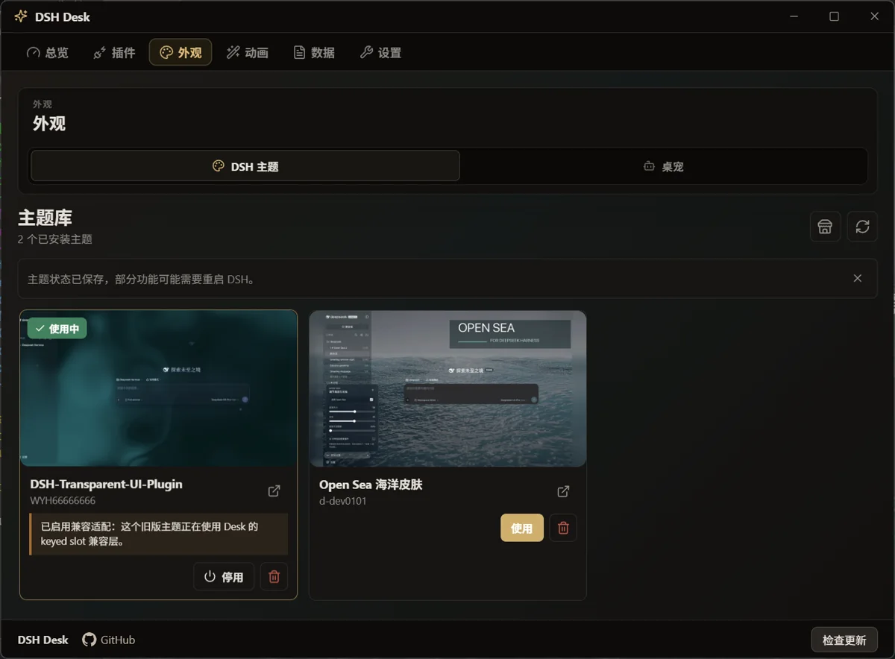
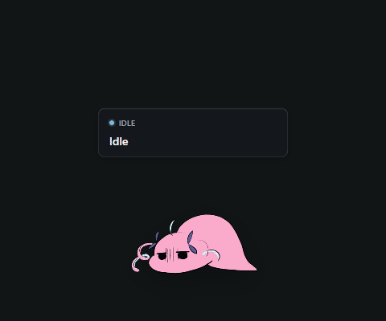

<p align="center">
  
</p>

<h1 align="center">DSH Desk</h1>

<p align="center">
  <sub><a href="README.md">简体中文</a> · <b>English</b></sub>
</p>

<p align="center">
  <strong>A desktop status monitor and pet companion for DeepSeek Harness, with 5,000+ pets for your DSH.</strong>
</p>

<p align="center">
  <a href="https://github.com/Renakoni/dsh-desk/releases/tag/v0.1.0"></a>
  &nbsp;
  <a href="https://github.com/deepseek-ai/deepseek-harness"></a>
  &nbsp;
  
  &nbsp;
  <a href="LICENSE"></a>
</p>

## What is DSH Desk

DSH Desk is a desktop management and interaction companion for [DeepSeek Harness](https://github.com/deepseek-ai/deepseek-harness). It turns DSH task progress, approval requests, and status changes into desktop pet interactions and system notifications. It also brings plugin, Skill, and theme management into one place.

## Interface preview

<p align="center">
  
  
</p>

## Highlights

**🐾 5,000+ desktop pets**

Works with the Codex Pet package format. DSH Desk ships with Minato Aqua, Yuexinmiao, and the DeepSeek Whale, giving your DSH access to more than 5,000 pets.

**🫧 DSH workflow events**

DSH task progress, tool calls, completions, errors, and approval requests appear in DSH Desk. Status changes drive pet animations, sounds, and desktop notifications. Permission requests can be approved directly from the desktop.

**📈 Local data dashboard and usage analytics**

Review session traces, tool performance, recent edits, token heatmaps, and usage broken down by model and project. Data stays local at `%APPDATA%\DSH Desk\dsh-usage.ndjson`; prompts, responses, and tool results are never uploaded.

**🧩 Profile-based extension management**

Compose plugins, Skills, and themes into reusable profiles. Enable or disable plugins and switch profiles to match different workflows.

**🪄 Plugin and theme marketplace**

Browse and install DSH plugins and Skills from the plugin marketplace. Preview, install, and update DSH Web themes, with support for common legacy theme registration patterns.

*Catalog sources:*

* **Plugins:** [awesome-dsh-plugin](https://awesome-dsh-plugin.com/plugins.json)
* **Skills:** [anthropics/skills](https://github.com/anthropics/skills) · [awesome-claude-skills](https://github.com/ComposioHQ/awesome-claude-skills) · [myclaude](https://github.com/cexll/myclaude) · [baoyu-skills](https://github.com/JimLiu/baoyu-skills)
* **Themes:** [awesome-dsh-themes](https://github.com/Renakoni/awesome-dsh-themes)

## Quick start

### Requirements

- Windows 10 / 11 x64
- Node.js (v22.12+)
- [DeepSeek Harness](https://github.com/deepseek-ai/deepseek-harness)

### Install

1. Download the [Windows installer (.exe)](https://github.com/Renakoni/dsh-desk/releases/download/v0.1.0/DSHDesk-Setup-0.1.0.exe) or [portable ZIP](https://github.com/Renakoni/dsh-desk/releases/download/v0.1.0/DSHDesk-0.1.0-portable.zip).
2. Launch DSH Desk and click **Install DSH plugin** in **Overview**.
3. Start (or restart) the DSH service:

   ```powershell
   npx @deepseek-ai/dsh web
   ```

<p align="center">
  
</p>

## Run from source

```powershell
npm install
npm run build
npm run start
```

Run the plugin tests separately with:

```powershell
npm test --prefix ./dsh-plugin
```

## License and attribution

The code is released under the [MIT License](LICENSE).

- **DeepSeek Harness:** DSH events, plugins, and approval protocols come from [deepseek-ai/deepseek-harness](https://github.com/deepseek-ai/deepseek-harness).
- **Minato Aqua:** the built-in Aqua pet is fan-made derivative artwork. The character belongs to COVER Corp. and the respective creators. It is for non-commercial use only and follows the [hololive derivative works guidelines](https://hololivepro.com/terms/).
- **Clawd Companion:** parts of the interface and event pipeline evolved from [Clawd Companion](https://github.com/Doulor/Clawd-Companion) (MIT © Doulor).
- **Codex Pets:** see the [OpenAI Pets documentation](https://learn.chatgpt.com/docs/pets) for the related pet format and customization details.
