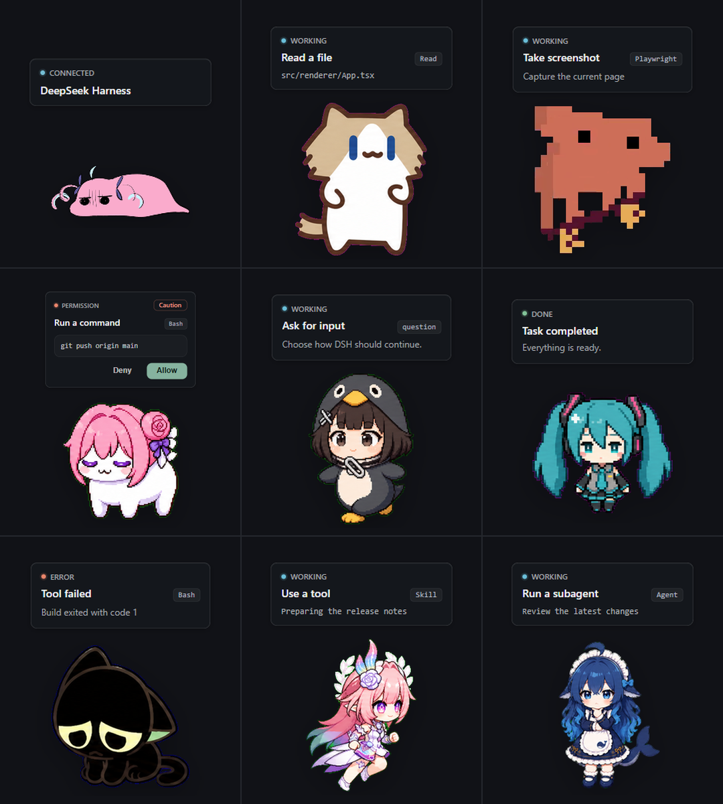
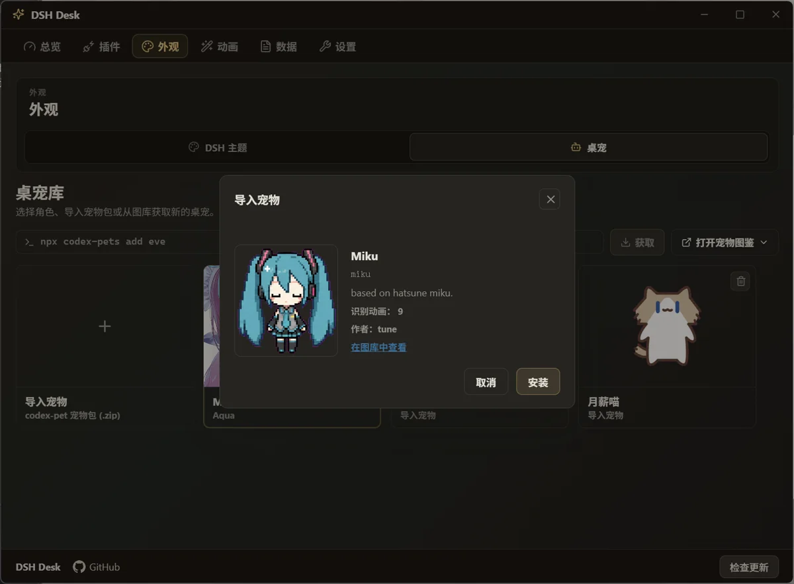
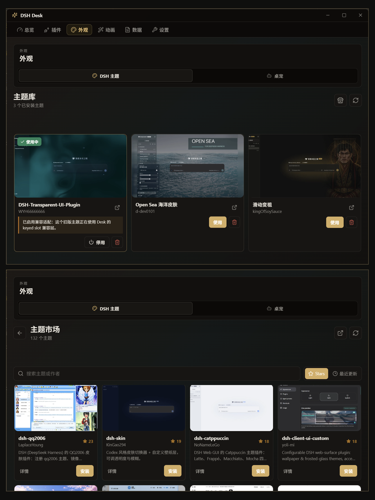
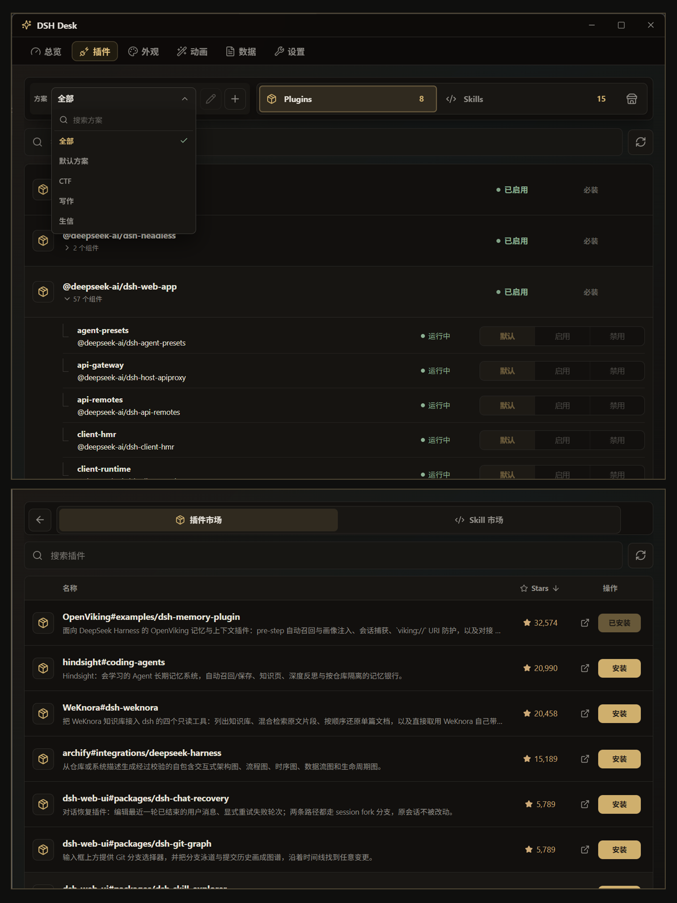

<p align="center">
  
</p>

<h1 align="center">DSH Desk</h1>

<p align="center">
  <sub><b>简体中文</b> · <a href="README.en.md">English</a></sub>
</p>

<p align="center">
  <strong>DeepSeek Harness 的桌面端状态监听与桌宠交互工具，为你的 DSH 带来 5000+ 桌宠。</strong>
</p>

<p align="center">
  <a href="https://github.com/Renakoni/dsh-desk/releases/tag/v0.1.1"></a>
  &nbsp;
  <a href="https://github.com/deepseek-ai/deepseek-harness"></a>
  &nbsp;
  
  &nbsp;
  <a href="LICENSE"></a>
</p>

## DSH Desk 是什么

DSH Desk 是为 [DeepSeek Harness](https://github.com/deepseek-ai/deepseek-harness) 开发的桌面端管理与交互工具。它将 DSH 后台的任务进度、权限审批和状态变化，以**桌面宠物交互**与**系统通知**的形式展现，同时集成了插件、Skill 和主题的集中管理。

## 界面预览

<p align="center">
  
  
</p>

## 核心亮点

**🐾 5000+ 桌宠生态**

兼容 Codex Pet 宠物包格式。开箱自带 Minato Aqua、月薪喵与 DeepSeek 鲸鱼娘，为你的 DSH 提供 5000+ 桌宠选择。

**🫧 DSH 工作流事件响应**

将 DSH 的任务、工具调用、完成状态、错误和权限事件接入 DSH Desk。任务状态变化会反映在桌宠动作、声音和桌面通知上，权限请求也可以直接在桌面端确认。

**📈 本地数据面板与用量分析**

集中查看会话轨迹、工具性能、最近编辑、Token 热力图，以及按模型和项目拆分的用量统计。数据保存在本地的 `%APPDATA%\\DSH Desk\\dsh-usage.ndjson`，不上传提示词、回复或工具结果。

**🧩 方案化扩展管理**

提供更强的 DSH 插件管理能力：插件可随时启用或停用，还能和 Skill、主题一起编排成模板，按不同工作场景快速切换。

**🪄 插件与主题市场**

插件市场提供海量 DSH 插件和 Skill 的浏览与安装；主题市场提供 DSH Web 主题的预览、安装、更新，并兼容常见旧版主题注册方式。

*数据源/上游收录：*

* **插件：** [awesome-dsh-plugin](https://awesome-dsh-plugin.com/plugins.json)
* **Skills：** [anthropics/skills](https://github.com/anthropics/skills) · [awesome-claude-skills](https://github.com/ComposioHQ/awesome-claude-skills) · [myclaude](https://github.com/cexll/myclaude) · [baoyu-skills](https://github.com/JimLiu/baoyu-skills)
* **主题：** [awesome-dsh-themes](https://github.com/Renakoni/awesome-dsh-themes)

## 快速开始

### 准备环境

- Windows 10 / 11 x64
- Node.js (v22.12+)
- [DeepSeek Harness](https://github.com/deepseek-ai/deepseek-harness)

### 安装步骤

1. 下载 [Windows 安装包 (.exe)](https://github.com/Renakoni/dsh-desk/releases/download/v0.1.1/DSHDesk-Setup-0.1.1.exe) 或 [免安装 ZIP](https://github.com/Renakoni/dsh-desk/releases/download/v0.1.1/DSHDesk-0.1.1-portable.zip)。
2. 启动 DSH Desk，在 **总览** 中点击安装 DSH 插件。
3. 启动（或重启）DSH 服务：

   ```powershell
   npx @deepseek-ai/dsh web
   ```

<p align="center">
  
  
</p>

## 从源码运行

```powershell
npm install
npm run build
npm run start
```

插件自身测试：

```powershell
npm test --prefix ./dsh-plugin
```

## 许可证与署名

代码基于 [MIT 许可证](LICENSE) 发布。

- **DeepSeek Harness**：DSH 事件、插件和 approval 协议来自 [deepseek-ai/deepseek-harness](https://github.com/deepseek-ai/deepseek-harness)。
- **Minato Aqua**：内置 Aqua 桌宠为粉丝创作的二次创作素材；角色版权归 COVER Corp. 及相关创作者所有，仅限非商业使用，并遵循 [hololive 二次创作指南](https://hololivepro.com/terms/)。
- **Clawd Companion**：部分界面与事件链路演化自 [Clawd Companion](https://github.com/Doulor/Clawd-Companion)（MIT © Doulor）。
- **Codex Pets**：相关桌宠与自定义宠物说明见 [OpenAI 官方 Pets 文档](https://learn.chatgpt.com/docs/pets)。
